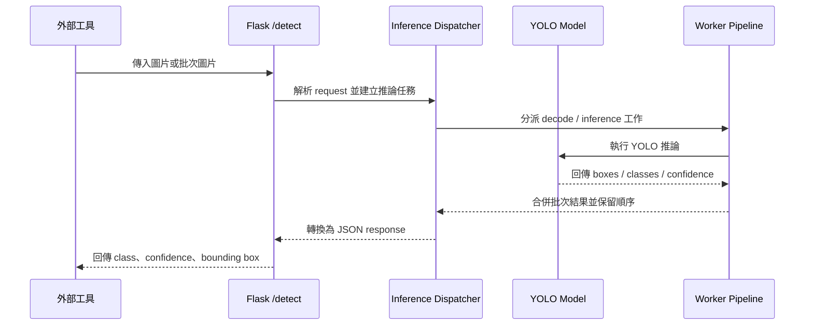

# YOLOTools

YOLOTools 是一套以 Python 建立的 YOLO 訓練、資料集整理、模型驗證與推論服務工具集。專案主要用於 2 類特定場景物件偵測流程，涵蓋資料前處理、模型訓練、批次驗證、HTTP 推論服務與 Windows GUI 工具化。

## 專案重點

- 整合資料集整理、YOLO 訓練、模型驗證與推論服務流程。
- 提供多個 PySide6 GUI 工具，降低重複命令列操作成本。
- 提供 YOLO HTTP 推論服務，讓外部工具可透過 API 共用同一個模型程序。
- 支援批次推論、worker pipeline、model warmup、server state 與 logging。
- 保留訓練輸出、metrics 圖表、confusion matrix 與模型權重，方便追蹤實驗結果。

## 工作流程


本專案將資料整理、模型訓練、驗證與推論服務拆成多個工具，讓模型實驗與後續系統整合可以分階段處理。訓練完成的 `.pt` 模型可由 HTTP 推論服務載入，其他工具不需要重複初始化模型即可取得偵測結果。

## 主要功能

### 資料處理與訓練輔助

- 影片抽幀與圖片解析度調整。
- YOLO label / zip 資料集整理與重標註。
- YOLO 模型版本轉換與權重下載。
- GUI 化訓練流程，降低手動維護訓練參數的成本。

### 模型驗證與推論

- 單次圖片驗證與批次圖片驗證。
- 批次圖片辨識結果檢視。
- YOLO HTTP server GUI，支援外部程式透過 HTTP 傳入圖片並取得偵測結果。

### 打包與部署輔助

- PyInstaller spec 與打包工具。
- Windows GUI 工具啟動與封裝流程。
- 推論服務可在系統托盤背景執行。

## YOLO HTTP 推論服務

`tools/yolo_server_gui` 是本專案中最完整的推論服務工具。它用 GUI 管理 Flask-based YOLO HTTP server，讓其他桌面程式、批次工具或服務共用同一個模型程序。

功能包含：

- 載入 `.pt` YOLO 模型。
- 設定 host、port、GPU worker、decode worker 與 HTTP worker。
- 提供 `/detect` API。
- 回傳 class、confidence、bounding box 等結構化偵測結果。
- 支援批次推論，並將大型請求切分到多個 worker pipeline。
- 支援 model warmup、server state、啟動錯誤處理與 logging。

詳細說明請見 [`tools/yolo_server_gui/README.md`](tools/yolo_server_gui/README.md)。

### `/detect` 資料流



推論服務的設計重點是讓多個外部工具共用同一個模型程序，減少重複載入 `.pt` 模型造成的 GPU 記憶體使用。批次請求會由 worker pipeline 切分處理，最後再合併為固定格式的 JSON 結果。

### API demo

單張圖片 request：

```json
{
  "threadName": "demo-single",
  "image": "<base64-image>",
  "conf": 0.25,
  "iou": 0.45
}
```

批次圖片 request：

```json
{
  "threadName": "demo-batch",
  "images": ["<base64-image-1>", "<base64-image-2>"],
  "conf": 0.25,
  "iou": 0.45
}
```

Response 會保留輸入順序，並回傳結構化偵測結果：

```json
{
  "threadName": "demo-single",
  "result": {
    "classifyType": "object_a",
    "percentage": 0.93,
    "detections": [
      {
        "classId": 0,
        "className": "object_a",
        "conf": 0.93,
        "xyxy": [120, 80, 360, 260]
      }
    ]
  }
}
```

相關行為由 `tools/yolo_server_gui/inference_dispatcher_unittest.py`、`server_runtime_unittest.py`、`server_startup_unittest.py` 與 `tray_controller_unittest.py` 覆蓋。

## 訓練成果範例

本專案保留了部分模型訓練輸出，包含 `results.csv`、PR/F1/Precision/Recall 曲線、confusion matrix、validation prediction 圖與 `weights/best.pt`。

其中一組 2 類物件偵測 YOLO detection 訓練結果：

- 訓練設定：120 epochs、batch 6、image size 640。
- 標註實例：約 20,362 筆。
- 驗證結果：precision 約 0.823、recall 約 0.747、mAP50 約 0.813、mAP50-95 約 0.513。

## 技術棧

- Python 3.12
- PySide6
- Flask
- OpenCV
- Ultralytics YOLO
- PyTorch
- NumPy
- pytest
- PyInstaller

完整依賴請見 [`requirements.txt`](requirements.txt)。

## 目錄結構

```text
tools/          主要 GUI / CLI 工具
models/         模型權重與訓練輸出
trainingData/   訓練資料
valData/        驗證資料
testData/       測試資料
workflow/       專案工作流程文件
docs/           補充文件
install/        安裝與輔助資源
```

完整工具清單請見 [`tools/README.md`](tools/README.md)。

## 快速開始

Windows PowerShell：

```powershell
py -3.12 -m venv YOLOToolsEnv
.\YOLOToolsEnv\Scripts\Activate.ps1
python -m pip install -r requirements.txt
```

啟動 YOLO HTTP server GUI：

```powershell
.\YOLOToolsEnv\Scripts\python tools\yolo_server_gui\app.py
```

## 開發與測試

執行 unit tests：

```powershell
.\YOLOToolsEnv\Scripts\python -m pytest
```

部分 GUI 或 GPU 推論流程需要本機 CUDA / PyTorch 環境與 `.pt` 模型檔。

## 注意事項

- `models/`、`trainingData/`、`valData/`、`testData/` 可能包含大型資料或模型檔，更新前請確認是否適合提交。
- 若 HTTP server 綁定 `0.0.0.0`，請確認網路環境與防火牆設定。
- 公開資料與模型前，請確認資料來源、授權與專案公開範圍。
